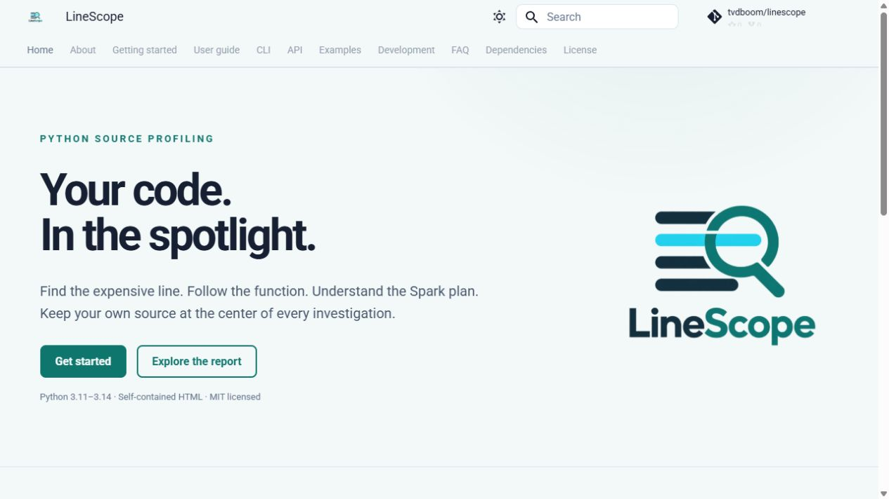

# Development
-------------

Contributions to code, tests, examples, and documentation are welcome. Read the
repository's [Code of Conduct][code-of-conduct] and `AGENTS.md` before starting.
Discuss large changes in an issue so the design stays focused on source-level
profiling.

## Set up

```console
git clone https://github.com/tvdboom/linescope.git
cd linescope
uv sync --locked
uv run pre-commit install
```

The source lives under `src/linescope`. This is a pure Python package. Normal
development needs no Rust toolchain, Node installation, [Java] runtime, or Spark
cluster. Optional integrations have their own environments.

## Everyday checks

```console
uv run pre-commit run --all-files
uv run pytest
uv build
uv run python -m mkdocs build --strict
```

Pre-commit runs Ruff linting/formatting, ty, lockfile validation, and file
hygiene checks.

`just` is optional: `uv tool install rust-just`, then `just --list`. The package
named `rust-just` supplies the task-runner binary; LineScope itself contains no
Rust code.

Use Backtide's NumPy-style docstrings with an imperative summary, a description,
and `Parameters`, `Returns`, and `See Also` sections where useful. Separate
parameters with blank lines and write optional values as `, default=...`. Use
types such as `dict[str, list[[SourceUnit]]]`, with square-bracket references
for package and third-party classes. Use single backticks for inline code. Move
notes and failure conditions into the description. Keep `Examples` in documented
public APIs, and leave a blank line before closing triple quotes. Wrap
documentation and docstrings at 80 columns.

Use a consistent module header:

```python
"""LineScope.

Author: Mavs
Description: Explain the module's responsibility.

"""
```

Separate logical steps with blank lines. Comments should explain non-obvious
decisions, ownership, or cleanup. Annotate public interfaces and cover changed
behavior with regression tests. Prefer assertions about semantics and structure
over exact timings.

Keep function signatures on one line when they fit within 99 columns. For
multiline signatures, put each parameter and parameter separator on its own line
and end the parameter list with a trailing comma so Ruff preserves the layout.


<br>

## Architecture

```text
Backend collection
    ↓
Backend adaptation / normalized measurements
    ↓
Project filtering and source snapshots
    ↓
Symbol index + notebook correlation + Spark observation
    ↓
ProfileResult / ProfileRun tree
    ↓
Self-contained HTML renderer
```

### Boundaries

`backends` collects measurements. `source` discovers project files, snapshots
text, and resolves navigation. `notebooks` captures virtual source and child
relationships. `spark` observes actions and normalizes plans/metrics. The
normalized `model` joins these concerns without depending on a backend's raw
result format. Rendering owns presentation only.

### Invariants

1. Full source is primary; functions are an index over source measurements.
2. Third-party implementation details stay outside the default source browser.
3. Missing metrics stay unknown, and sampling never fabricates hit counts.
4. Source links target individual resolvable symbols, not arbitrary whole lines.
5. Spark transformations remain lazy; observer code never adds an action.
6. Python wall time, distributed executor metrics, and memory domains stay
   separate.
7. Notebook source is snapshotted; separate child runs form a tree.
8. Hooks and patched methods are restored after errors as well as successful
   runs.
9. Reports escape source/metadata and work without external scripts or
   stylesheets.


<br>

## Testing

The normal pytest suite is offline and covers project discovery, source
snapshots, symbol resolution, timing normalization, report escaping,
lifecycle/error cleanup, CLI scripts/modules, notebook sessions, child
correlation, and Spark adapters using controlled fakes.

```console
uv run tox -e pre-commit
uv run pytest -m "not spark and not scalene and not databricks"
uv run pytest --cov=linescope --cov-report=term-missing
uv run tox -m unit
uv run tox -e py311-min
uv run tox -e docs
```

Tox tests installed wheels on Python 3.11–3.15. CI runs these on Linux, Windows,
and macOS. Python 3.14 records branch coverage with a 70% floor. The minimum
environment resolves the oldest supported direct dependencies rather than
reusing only the latest lock resolution. The workflow lists pre-commit first,
unit, notebook, and package checks next, then Scalene, optional Spark, and
documentation last. Jobs can run in parallel; documentation waits for the
notebook checks. Pre-commit covers linting without a separate lint environment.

### Notebook execution

Like ATOM, LineScope uses the `nbmake` pytest plugin to run example notebooks
from top to bottom in real Python kernels. Run the separate environment with
[Java] 17 (or a version supported by your Spark release) available:

```console
uv run tox -e notebooks
```

This environment installs the built wheel with the notebook and Spark extras,
registers its own Python kernel, and executes every notebook in
`examples/notebooks` with a 600-second cell timeout. It runs copies in tox's
temporary directory so generated reports stay out of the source examples. Cell
errors fail the check; the original notebooks keep their unexecuted cells and
empty outputs. The Databricks example's portable cells run locally, while
workspace-specific `%run` and child-job checks still require the manual
acceptance below.

The `examples-tests` CI job runs on every push and pull request, with [Java] and
PySpark available. Documentation builds wait for that job. Release validation
also runs `notebooks` before building distribution artifacts, publishing the
package, or deploying documentation. MkDocs continues to render notebooks with
`execute: false`; ordinary unit tests do not start Spark.

### Optional integration environments

```console
uv run tox -e scalene
uv run tox -e spark
```

The unit suite tests Scalene normalization and lifecycle with controlled fakes.
Its separate integration environment uses the included Scalene dependency and
verifies real CPU sampling, native memory collection, repeated sessions, source
snapshots, live previews, and hook/thread cleanup. This keeps native collection
out of the ordinary unit matrix. Run it on a supported Windows/Linux/macOS
environment. Sampling tests assert structure rather than exact timings.

Local Spark uses [Java] 17 (or a version supported by your Spark release) and
`local[2]`; there is no external cluster. Its environment sets
`LINESCOPE_TEST_SPARK=1`. Both integration jobs use Python 3.11 to exercise
LineScope's minimum supported Python; this is a baseline coverage choice, not a
Spark-specific Python requirement. The optional manual CI input enables the real
Spark job, while the ordinary suite exercises fake JVM/Databricks objects.
Windows parquet-write success cases require Hadoop native tools and skip when
those are absent; the Linux integration covers the corresponding write/scan
behavior. Failed action tests verify that profiling preserves the workload's
original exception.

Databricks itself requires a manual workspace check: profile a cell, several
cells, inline `%run`, a child notebook call, and a Spark action. Verify source
identity, one final report, child relationships, parameter redaction, and
available final plans. Mock tests cannot validate workspace access policies or
every Databricks runtime variation.

For report acceptance, open a generated HTML file and verify file, symbol,
Spark, and notebook links, browser back/forward navigation, light/dark styling,
and narrow-screen layout. Reports must work offline without a JavaScript CDN.

<br>

## Documentation development

LineScope uses Backtide's Material for MkDocs setup, adapted for a Python-only
project. The source is `docs_sources`; generated output is `docs` and stays out
of version control.

```console
uv run python -m mkdocs serve --dev-addr 127.0.0.1:8001
uv run python -m mkdocs build --strict
```

### API pages

`docs_sources/scripts/autodocs.py` is adapted from Backtide's renderer. It reads
NumPy-style docstrings and supports signatures, summaries, parameter tables,
return values, methods, examples, and source links. A page uses directives such
as:

```text
:: linescope:configure
    :: signature
    :: head
    :: table:
        - parameters
        - returns
    :: see also
```

Use ordinary Markdown links for prose. The custom reference helper also
understands Backtide's short reference syntax. Keep symbols documented before
linking to them. Write `[ProfileResult]` to link an internal API class, or
`[DataFrame]` to link Spark's official class reference. Register external types
in `CUSTOM_URLS` in `autodocs.py`, using a lowercase key and its official URL.
Inside a container, write `list[[ProfileResult]]` so the type remains readable
and the class reference stays clickable.

### Executable examples

Explicit `pycon` fences run during a documentation build through `autorun.py`,
which follows Backtide's console-transcript convention. Ordinary `python` fences
only display source. Executed fences have isolated namespaces and fail the build
on exceptions. A statement ending in `# hide` runs invisibly; `# norun` displays
without execution.

Examples must be offline, deterministic, and fast. Do not launch a browser,
start Spark, call a remote notebook, or save a persistent report during a build.

Runnable Python examples live in `examples`. Documentation includes their source
through the existing documentation hook with a directive such as:

```text
:: example: filename.py
```

The hook inserts ordinary Python fences, so displayed code stays identical to
the runnable files without executing them. Add new runnable examples there and
include them instead of maintaining a shortened copy. Missing source files fail
the build.

### Rendered notebooks

Notebook examples use the same `mkdocs-jupyter` plugin as
[ATOM](https://github.com/tvdboom/ATOM). The plugin renders Markdown, code
cells, and saved outputs as documentation pages, with a table of contents and a
download button. `execute: false` in `mkdocs.yml` prevents notebooks from
running during a build, including Spark and Databricks cells. The bundled
notebooks have unexecuted cells so users can run them in their own environment.

Keep runnable notebooks in `examples/notebooks` and matching documentation
copies in `docs_sources/examples/notebooks`. When adding or editing a notebook,
update both copies and add its documentation path to the **Examples > Rendered
notebooks** navigation in `mkdocs.yml`. Link to the `.ipynb` path from Markdown
to open its rendered page. The plugin's `include_source` option copies the
original notebook beside that page, and `overrides/main.html` uses `page.nb_url`
for the download button. Markdown guides can set `notebook` metadata to the
download path, for example `examples/notebooks/quickstart/quickstart.ipynb`.

### Theme

`overrides/main.html` retains Backtide's title/version/download controls.
`overrides/home.html` provides the branded landing page. The shared stylesheet
applies teal and cyan colors in light and dark modes. Reports have their own
embedded assets and do not depend on MkDocs.



Versioned publication uses `mike`; see [releasing](#releasing).

<br>

## Releasing

### One-time repository setup

- Enable GitHub Pages for the branch used by `mike` (normally `gh-pages`).
- Configure the `github-pages` and `pypi` environments with appropriate release
  protection.
- Register a PyPI trusted publisher for this repository's `publish.yml`
  workflow.
- Optionally add the Codecov token for coverage uploads.

### Release process

Update the version in `pyproject.toml` and the package version, refresh
`uv.lock`, and run the full test/documentation/build checks. Review release
notes and build artifacts before creating a matching `vX.Y.Z` tag.

The tag workflow validates the version, checks the package, builds one universal
Python wheel and source distribution, then uses trusted publishing. It also
deploys versioned docs with `mike` and updates the `latest` alias. Pure Python
wheels need no per-platform Rust builds.

No release tag, package publication, or documentation deployment is part of
ordinary local development. Run `uv build`, then `uvx twine check dist/*`, and
inspect `dist` to validate an artifact locally.
