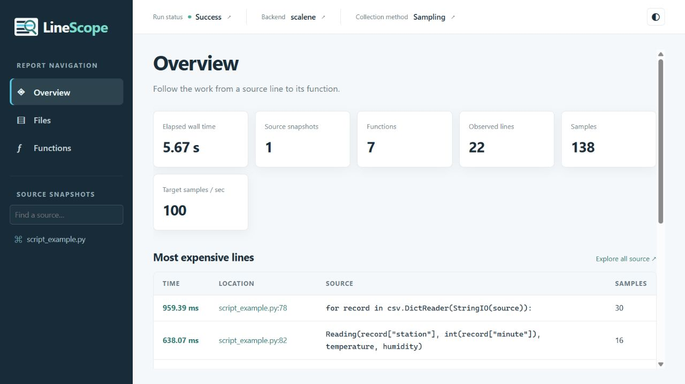
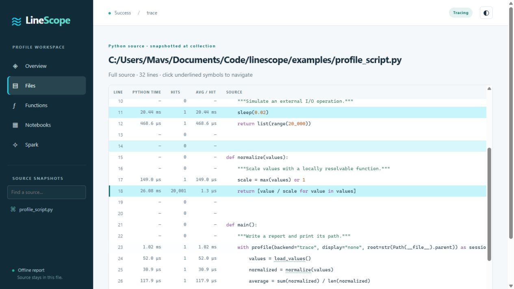

# Reports

A report is a small source browser. Select Overview to find hot lines, Files to
inspect the surrounding code, Functions to jump to definitions, and the
notebook/Spark views for contextual information. Source snapshots remain
available even after the original files change.

The Notebooks view appears when the report contains notebook snapshots or child
notebook invocations. The Spark view and its overview count appear only when
Spark executions were captured, including executions in child notebooks.

This example comes from the repository's `examples/script.py`. Times depend on
the machine, backend, and workload; the screenshot illustrates the report rather
than a benchmark.

## The main views

| View | Question it answers |
| --- | --- |
| Overview | Where should I start investigating? |
| Files | Which lines in this source file consumed time? |
| Functions | Where is it defined, and what time was attributed to it? |
| Notebooks | Which captured cells and child notebooks belong to this run? |
| Spark | Which action ran, and what did Spark execute? |

## Line columns

| Column | Interpretation |
| --- | --- |
| Time | Time attributed to the source line by the active backend |
| Hits | Recorded executions when the backend supports them |
| Average | Time divided by hits, only when both are available |
| Memory | Python-driver delta/peak values, when supported and requested |
| Estimated GPU time | Sampled device work, separate from driver wall time |
| GPU peak memory | Highest sampled device-memory value for the line |
| Spark | Separate navigation references to observed executions |

Heat intensity makes expensive lines easier to find. Unexecuted source stays
visible. A dash means unavailable or unmeasured; sampled zeroes do not prove
that a line took no time.

The [backend](backends.md) determines which columns can contain measurements.

## Source snapshots

Project discovery uses the configured root, nearby project metadata, and
explicit include/exclude rules. Installed third-party libraries, interpreter
internals, and unrelated files remain outside the source browser. Their work can
still contribute to the calling project's measured time.

Source is stored with the profile result, including notebook cells. Editing or
deleting the original file later does not change the saved report. A source unit
has an identifier, original path, text, and kind (`python` or `notebook`).

Python source titles and file lists show only the filename. Files with the same
name keep distinct navigation targets through their original source identities.

See [configuration](introduction.md#configuration) for scope controls.

## Source navigation

Function and class links target their definitions. Each call is linked
separately, so `outer(inner(value))` can have two links. An unresolved or
third-party call remains unlinked. Spark badges are separate from symbol links.
Notebook paths can point to captured notebook source or child-run metadata.

Static analysis builds an index of project functions, classes, methods, imports,
and call sites. The renderer links individual symbol spans. Multiple calls on
one line remain separate targets. Known local class instances can resolve
methods; dynamic dispatch, runtime imports, and ambiguous names may remain
unlinked. An absent link is preferable to a misleading destination.

Includes and excludes are scope controls, not a mechanism for obtaining private
code from inaccessible locations. Notebook references use captured or explicitly
registered source.

The report uses hash navigation, line links, and browser back/forward controls.
It does not fetch source from a server.

## Saving and sharing

Call `session.save("report.html")` to write a self-contained HTML report. The
file embeds its source and assets and works offline without the original project
files or a running server.

Review the embedded source, paths, and integration metadata before sharing
outside your project, especially notebook cells containing inline credentials or
private paths. Escaping prevents source text from becoming executable HTML; it
does not remove sensitive source.
